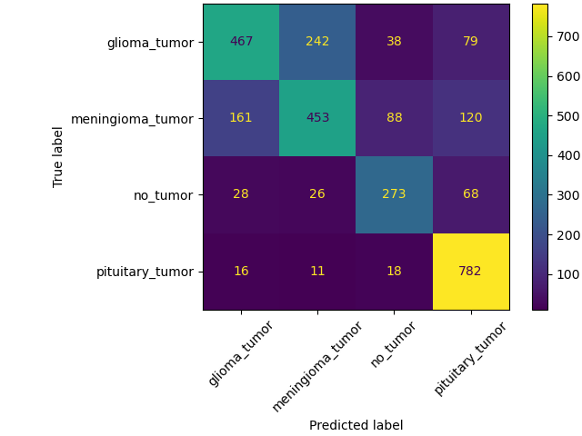
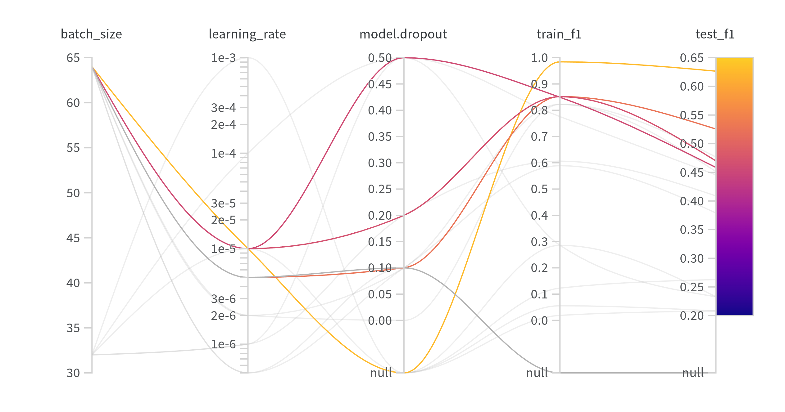
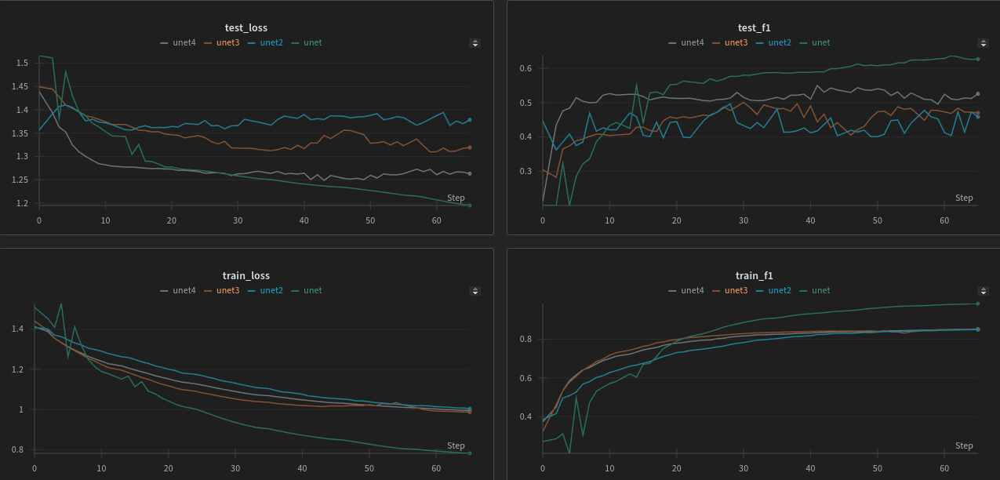
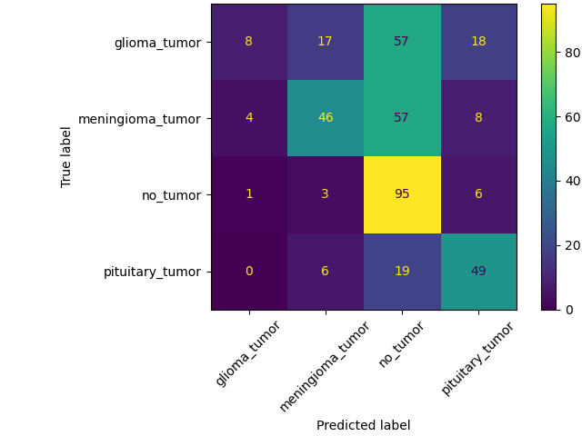

# CNN

For this task I chose a dataset of brain tumor MRI classification, available on [kaggle](https://www.kaggle.com/datasets/bilalakgz/brain-tumor-mri-dataset). Dataloading can be found in `cnn/dataset/dataset.py`. The images are converted to grayscale and resized to 128x128 pixels. The task is to classify brain tumor scans to four classes.

# Manual convolution

The convolution for images is defined in a following way

$$(f*g)[x, y] = \sum_{i=-k_c}^{k_c}\sum_{j=-k_c}^{k_c} f(x-i, y-j) g(i, j), \quad k_c = \frac{k-1}{2},$$

where $f$ is our image, $g$ is the kernel, $x$ and $y$ are coordinates of the image, $k$ is the size of the kernel.
The result of applying convolution to 3 random images from the dataset is below. The 5x5 horizontal edge detection kernel is taken as

$$\begin{bmatrix}
-2 & -2 & -2 & -2 & -2 \\
-1 & -1 & -1 & -1 & -1 \\
0 & 0 & 0 & 0 & 0 \\
1 & 1 & 1 & 1 & 1 \\
2 & 2 & 2 & 2 & 2
\end{bmatrix}$$

The Gaussian blur kernel is a regular Gaussian curve as a function of the distance from the center value. The standard deviation is taken as 1 and the values are normalized so the maximum value is 1.
The sharpening filter consists of values -1 and the center value is $(k-1)^2$. For example the 3x3 kernel is

$$\begin{bmatrix}
-1 & -1 & -1 \\
-1 &  4 & -1 \\
-1 & -1 & -1
\end{bmatrix}.$$

# Simple model

The objective is not to train the most accurate model but rather the idea is to put togehter all tricks of CNNs we have learned
- skip connections,
- 1x1 convolution across channels,
- SE block for providing "attention" across channels.

The model definition is in the file `cnn/simplecnn.py`. An overview of the trained models is shown below, where each line corresponds to one model and it passes through the hyperparameters used.

The learning curves of these models are below. We can see that the training loss is decreasing for all of them. However, the test loss does not improve very much. The F1 score does also steadily increase for both training and test sets. The learning curves suggest the training could have lasted for longer but the model took quite a long time to complete 60 epochs.

The models performance is illustrated below with confusion matrices for the best performing model number 8. We can see that the model performs good for training dataset but quite poorly for the test dataset. This suggests the model is overfitting to the training data and is not able to generalize the patterns.

| Train confusion matrix | Test confusion matrix |
| --- | --- |
|  |  |

# Transfer learning

I am using the U-Net model trained for brain scan segmentation, from [here](https://pytorch.org/hub/mateuszbuda_brain-segmentation-pytorch_unet/).

The idea is to use the model's ability to encode the scan's information in the bottleneck layer. I will run the model until bottleneck and then train a classifier that uses this encoded information to classify the brain scan. The bottleneck layer is also trained to fine tune for features that are needed for this task. The model definition is in `cnn/unet_transfer.py`. The overview of trained models is show again below.

The learning curves look much nicer for this model as the training and test loss are clearly more correlated. And the F1 score reaches 0.63 for the test set.

The confusion matrices indicate also that the model was learning and the difference between test and train dataset is not as big. The model still struggles with the features of glioma_tumor and it predicts no_tumor the most.
| Train confusion matrix | Test confusion matrix |
| --- | --- |
|  |  |
