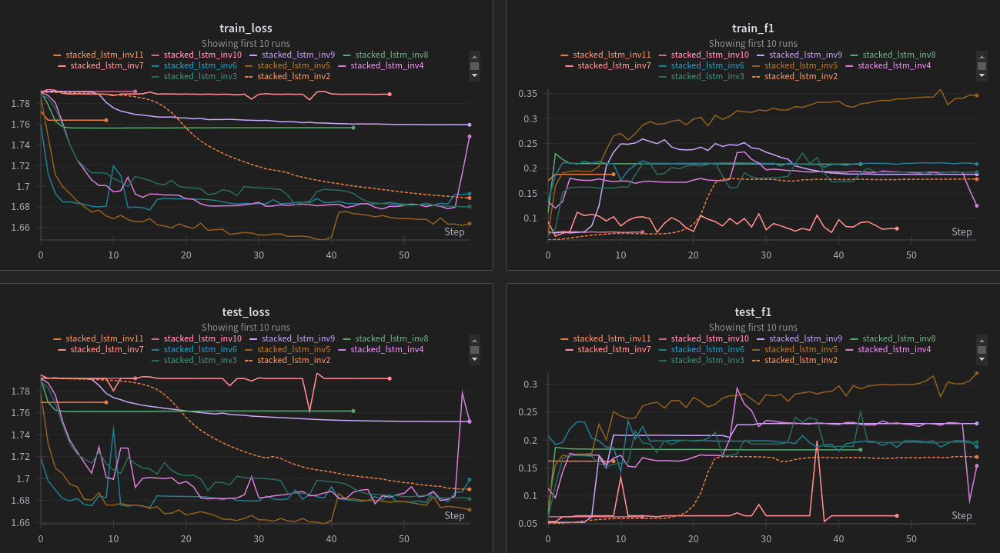

# RNN

For this task I chose a time series dataset to predict activity of a person carrying a smartphone. The dataset is available on [UCI Machine Learning Repository](https://archive.ics.uci.edu/dataset/240/human+activity+recognition+using+smartphones). Dataloading can be found in `cnn/dataset/dataset.py`. Data is a time series for accelerometer and gyroscope data for each of the three axis, so 6 features. The gravity vector is substracted from the accelerometer values. The classes are numbered as follows

1. WALKING
2. WALKING_UPSTAIRS
3. WALKING_DOWNSTAIRS
4. SITTING
5. STANDING
6. LAYING

The features have the following summary statistics. All features have a mean zero and the standard deviation is also quite similar, meaning that all the features are on a similar scale and do not need standatization. The quantiles, $q_{0.2}$ and $q_{0.8}$ show that the distributions are quite symmetric for all features.
| feature | mean      | std       | $q_{0.2}$ | $q_{0.8}$|
| ---     | ---       | ---       | ---       | ---    |
| acc_x   | -0.0006   | 0.1948    | -0.0868   | 0.0214 |
| acc_y   | -0.0003   | 0.1224    | -0.0235   | 0.0507 |
| acc_z   | -0.0003   | 0.1069    | -0.0325   | 0.0342 |
| gyro_x  | 0.0005    | 0.4068    | -0.1221   | 0.1387 |
| gyro_y  | -0.0008   | 0.3819    | -0.1175   | 0.0875 |
| gyro_z  | 0.0001    | 0.2557    | -0.0698   | 0.1021 |

Plotting all time series against their corresponding activity yields in the following graph. It is hard to make any distinction from this. It can be seen that the activities that invlove continuous movement have a larger span for all features than those sitting, standing or laying. Since there are no other clear patterns here, we have to hope that there is a temporal pattern that helps us categorise the time series further.

# Stacked LSTM

A very easy LSTM model is defined with a classifier that takes in the last hidden state. See `rnn/stacked_lstm.py`. Only important thing is that since the data is given in the smarphone's coordinates, but we want the classification to be invariant of the coordinate change, we use only the length of the acceleration and gyroscope vectors.
The overview of training is shown below.

Learning curves show that it was hard to find parameters that would perform well. The training is quite sensitive to the hyper parameters. Many models train and then hit a plateau. This is because all models predict quite easily the moving versus still activities. However, it could not classify moving activities into just walking or walking on the stairs and the same is true for the still activities.

The confusion matrices for the best model are below. Here we can see that even the best model could distinguish the active and still activites but it could not classify it very much further.
| Train confusion matrix | Test confusion matrix |
| --- | --- |
|  |  |

# GRU

The GRU is defined from scratch in the file `rnn/gru.py`. Again only the magnitude of acceleration and gyroscope vectors are used. The model has only one layer. The overview of trained models is below.

As we can see that learning converges very rapidly and the reason again is that the model classifies only if the person is moving or not.

The confusion matrices of the best model confirm that it can only predict walking or staying still.
| Train confusion matrix | Test confusion matrix |
| --- | --- |
|  |  |

# Transfer learning

The file `rnn/sentiment_transfer.py` includes the model definition of a transfer learning model. The base model is a [HuggingFace model](https://huggingface.co/cardiffnlp/twitter-roberta-base-sentiment-latest) that is meant for text sentiment classification. The idea here is to encode our time series into embeddings instead of words. Thats why there is this learnable tokenizer layer defined. The original model is defined to classify into 3 classes, so we swap the last linear layer so that the output has 6 classes. The rest of the model is freezed and used as is.

Unfortunately, due to time constraints and computational expense I could not run a meaningful training session on this model. The inference works and the training loop does one epoch in quite a long time with no errors.
